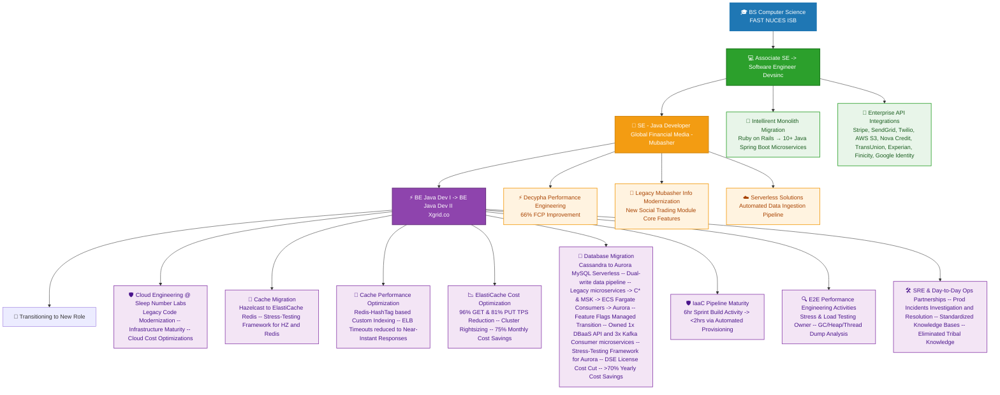

# Hey there! 👋 I'm Khawaja

<div align="center">
  
</div>

<div align="center">
  
[](https://linkedin.com/in/khawajaabdullahansar)
[](mailto:khawaja.abdullah.ansar@gmail.com)
[](tel:+923175802542)


</div>

---

## 🚀 About Me

```java
/**
 * Represents the engineering profile of Khawaja Abdullah Ansar.
 * Focused on high-scale distributed systems and performance.
 */
public record Khawaja() {

    public static final String FULL_NAME = "Khawaja Abdullah Ansar";
    public static final double EXPERIENCE_IN_YEARS = 3.5;

    public static final List<String> BUSINESS_DOMAINS = List.of(
        "Real Estate", "FinTech", "HealthCare", "IoT"
    );

    public static final List<String> NOTABLE_PRODUCTS = List.of(
        "Intellirent", "Decypha", "Mubasher Info", "SleepNumber"
    );

    public static final List<String> EXPERTISE = List.of(
        "Microservices Architecture",
        "Cloud-Native Development",
        "Performance Engineering",
        "Distributed Systems Design",
        "Legacy System Modernization"
    );

    public static void printCurrentFocus() {
        System.out.printf("""
            Current Focus: Solving distributed system challenges @ Sleep Number Labs
            Primary Task: Supporting MSK upgrade from Kafka v3.5.1 %s v3.9.x
            """, "→");
    }

    public static List<String> engineeringPhilosophy() {
        return List.of(
            "Clean code",
            "Resilient architecture",
            "Relentless optimization"
        );
    }

    public static boolean isGrowthMinded() {
        return true;
    }

}

```

---

## 🛠️ Tech Stack

### **Core Languages**


### **Frameworks & Libraries**


### **Cloud & Infrastructure**


#### **AWS Ecosystem**


### **Databases & Storage**


### **Messaging & Caching**


### **Testing & Quality Assurance**


### **DevOps & CI/CD**


### **Monitoring & Observability**


### **API & Protocols**


---

## 🏗️ Architecture & Engineering



---

## 📊 GitHub Analytics

<div align="center">
  
</div>

---

## 🌐 Let's Connect

```javascript
const connect = {
  linkedin: "https://linkedin.com/in/khawajaabdullahansar",
  email: "khawaja.abdullah.ansar@gmail.com",
  interests: ["Clean Code", "Java", "Distributed System Design", "Cloud Architecture"],
  collaboration: "Always open to interesting technical discussions!"
};
```

</div>
